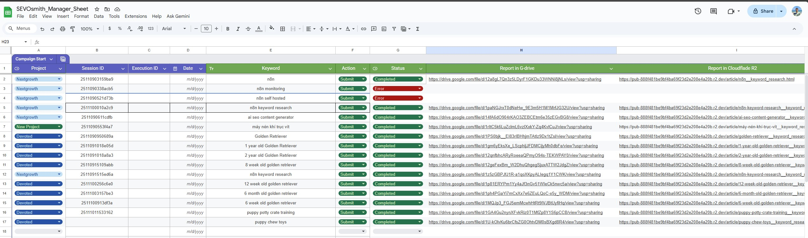

# SEVOsmith Keyword Orchestrator

> The Definitive Engine for Fully Automated Keyword Research using n8n and DataForSEO.

Your keyword research process is broken. It's a chaotic scramble across a dozen different tools, a manual grind of merging messy CSVs, and a constant battle against brittle workflows that fail silently. This isn't strategy; it's a bottleneck that kills efficiency and drains your budget on redundant API calls.

The **SEVOsmith Keyword Orchestrator** is the delivery on the promise of true automation. It's not a simple template; it's a production-grade system, engineered to execute a complete, multi-vector **n8n keyword research** strategy from start to finish.

 

> **Note:** This workflow is offered on Gumroad to help support its continued development and to allow for optional tips. Your support is greatly appreciated!

 

---

> *A high-level view of the SEVOsmith Keyword Orchestrator workflow in n8n.*

> *Screenshot of the Google sheet manager*

## 🤖 Key Features

This system is designed to turn the raw, disconnected data from **DataForSEO** into a cohesive, actionable intelligence report.

🧠 **360-Degree Intelligence Gathering**
The Orchestrator deploys nine parallel agents to query the entire search ecosystem using **DataForSEO**—from Google and YouTube SERPs to AI Overviews and search intent signals.

🎯 **Automated Synthesis Core**
The system's code-based "brain" ingests the chaotic outputs from all APIs and programmatically unifies them into a single, clean, and structured data object. It's the alchemist that forges your "Strategic Report."

🔍 **Production-Grade Resilience & Error Handling**
Every API call is individually validated. Any failure is instantly caught, logged in your control sheet, and triggers an email notification—without halting the entire process.

🔄 **Zero-Waste Caching Engine**
True automation is efficient. The integrated caching layer checks for existing research before every run, delivering instant results on repeat queries and saving you significant **DataForSEO** API costs.

🌐 **Instant, Interactive Deliverables**
The final "Strategic Report" is more than a data dump. It's a professional, self-contained HTML document with filterable tables, dynamic charts, and automated topic clustering.

## 📊 Live Demos: See the Final Report

Talk is cheap. The real proof is in the final product. Click on the live demos below to explore the interactive HTML reports generated by this workflow.

*   **Commercial Investigation Query :** `puppy chew toys`
    *   **[➤ View Live Report](https://pub-888f481be9bf4ba69f23d2e208e4a20b.r2.dev/article/puppy-chew-toys__keyword_research.html)**

*   **Commercial Investigation (Best X for Y):** `best seo tool for agencies`
    *   **[➤ View Live Report](https://pub-888f481be9bf4ba69f23d2e208e4a20b.r2.dev/article/best-seo-tools-for-agencies__keyword_research.html)**

*   **Broad Topic Query:** `golden retriever`
    *   **[➤ View Live Report](https://pub-888f481be9bf4ba69f23d2e208e4a20b.r2.dev/article/golden-retriever__keyword_research.html)**

## ⚙️ How It Works: The Six Modules of the Intelligence Engine

<strong>► Click to expand the full architectural breakdown</strong>

1.  **Job Initiation & State Management:** A robust, stateful job queue using Google Sheets ensures every research task is processed reliably (`To_Do` -> `Processing` -> `Completed`).

2.  **Intelligent Caching & Cost Control:** A unique `cache_key` is generated for each job. The workflow queries an internal n8n Data Table first, bypassing all API calls on a cache hit.

3.  **The Parallel Data-Fetch Core:** On a cache miss, it simultaneously queries nine **DataForSEO** endpoints, with real-time validation to ensure the system is resilient and never fails silently.

4.  **The Synthesis Engine—The Single Source of Truth:** A sophisticated JavaScript node (`Normalize_and_Compact`) programmatically cleans and reshapes varied JSON into a single, predictable data model.

5.  **Interactive Report Generation & Data Persistence:** Transforms the synthesized data into the polished, interactive HTML report and an optional raw data Google Sheet.

6.  **Delivery, Caching & Finalization:** Handles the "last mile" tasks: uploading reports, sending a notification email, saving new data to the cache, and updating the job's status.

## 🚀 Getting Started

1.  **[Get the Workflow on Gumroad](<YOUR_GUMROAD_LINK_HERE>)**. Your download will include the workflow `.json` file and a comprehensive PDF setup guide.
2.  Follow the PDF guide to set up your Google Drive environment and copy the required template files.
3.  Import the workflow `.json` file into your n8n instance.
4.  Connect your API credentials for **DataForSEO** and Google Services as instructed in the guide.
5.  Activate the workflow and trigger your first run by adding a new job to your Google Sheet.

## ⚡ Technical Requirements

*   An **n8n** instance (self-hosted or cloud).
*   API accounts for: **DataForSEO** and **Google Services** (Sheets, Drive, Gmail).
*   (Optional) An S3-compatible account (like Cloudflare R2 or AWS S3).
*   Basic familiarity with **n8n** and connecting API credentials.

---

## ❤️ Support the Project

If you find this workflow valuable, please consider supporting its ongoing development and the creation of more open-source templates. A coffee goes a long way!

## 📄 License

This project is licensed under the MIT License - see the [LICENSE.md](LICENSE.md) file for details.
