# SEVOsmith Keyword Orchestrator: From Raw Data to Strategic Report - Fully Automated Keyword Research using n8n and DataForSEO

Your keyword research process is broken. It's a chaotic scramble across a dozen different tools, a manual grind of merging messy CSVs, and a constant battle against brittle workflows that fail silently. This isn't strategy; it's a bottleneck that kills efficiency and drains your budget on redundant API calls.

The **SEVOsmith Keyword Orchestrator** is the delivery on the promise of true automation. It's not a simple template; it's a production-grade system, engineered to execute a complete, multi-vector **n8n keyword research** strategy from start to finish.

> *A high-level view of the SEVOsmith Keyword Orchestrator workflow in n8n.*

 

> **Note:** This workflow is offered on Gumroad to help support its continued development and to allow for optional tips. Your support is greatly appreciated!

 

---

## Table of Contents

1.  [🤖 Key Features](#-key-features)
2.  [🎁 The Deliverable: Your Interactive Strategic Report](#-the-deliverable-your-interactive-strategic-report)
3.  [💡 From Intelligence to Action: What You Can Build Next](#-from-intelligence-to-action-what-you-can-build-next)
4.  [🔬 The Anatomy of a Strategic Report: Why Nine APIs?](#-the-anatomy-of-a-strategic-report-why-nine-apis)
5.  [📊 Live Demos](#-live-demos)
6.  [⚙️ Workflow Architecture](#️-workflow-architecture)
7.  [🚀 How It Works: The Six Modules](#-how-it-works-the-six-modules-of-automation)
8.  [🛠️ Setup & User Guide](#️-setup--user-guide)
9.  [💡 The Road Ahead: The Full SEVOsmith Vision](#-the-road-ahead-the-full-sevosmith-vision)
10. [❤️ Support the Project](#️-support-the-project)
11. [📄 License](#-license)

---

## 🤖 Key Features

This system is designed to turn the raw, disconnected data from **DataForSEO** into a cohesive, actionable intelligence report.

#### 🧠 360-Degree Raw Data Gathering
The Orchestrator deploys nine parallel agents to query the entire search ecosystem using **DataForSEO**—from Google and YouTube SERPs to AI Overviews and search intent signals. This is the "Raw Data" firehose, comprehensively collected.

#### 🎯 The Automated Synthesis Core
This is where data becomes strategy. The system's code-based "brain" ingests the chaotic outputs from all APIs and programmatically unifies them into a single, clean, and structured data object. It's the alchemist that forges your "Strategic Report."

#### 🔍 Production-Grade Resilience & Error Handling
A workflow that breaks on a single failed API call isn't "Fully Automated." Every API call is individually validated. Any failure is instantly caught, logged, and triggers an email notification—without halting the entire process.

#### 🔄 The Zero-Waste Caching Engine
True automation is efficient. The integrated caching layer checks for existing research before every run, delivering instant results on repeat queries and saving you significant **DataForSEO** API costs.

#### 🌐 Instant, Interactive Deliverables
The final "Strategic Report" is more than a data dump. It's a professional, self-contained HTML document with filterable tables, dynamic charts, and automated topic clustering, ready for stakeholders or clients.

## 🎁 The Deliverable: Your Interactive Strategic Report

This workflow doesn't just give you data; it delivers a polished, self-contained **HTML intelligence report** designed for rapid strategic decision-making. Forget impenetrable spreadsheets. This is what you get:

#### **At-a-Glance Strategic Overview**
Instantly grasp the topic's viability. The report opens with a high-level dashboard featuring:
*   **Key Performance Indicators:** Prominent stat cards for the primary keyword's **Search Volume**, **AI Search Volume**, **Keyword Difficulty**, and **CPC**.
*   **Visual Trend Analysis:** An interactive chart visualizes the monthly search volume trend for the past year, allowing you to spot seasonality and growth potential at a glance.

#### **Interactive Keyword Deep-Dive**
This is where you find the hidden gems. The report contains a powerful, interactive data table that puts you in control:
*   **Filter, Sort, and Search:** Instantly search through hundreds of keywords. Filter by minimum/maximum volume, user intent, or keyword source. Sort any column to pinpoint high-opportunity keywords instantly.
*   **Data-Rich Views:** See all critical metrics—Volume, KD, CPC, Intent, and Source—in one unified table.
*   **Export to CSV:** With one click, export your filtered view for use in other tools or reports.

#### **Automated Topic Clustering & SERP Insights**
Understand user intent and how to structure your content with confidence:
*   **Clickable Topic Clusters:** The report intelligently groups related keywords into clickable "Topic Cluster" cards. Click a cluster to instantly filter the main data table and explore sub-niches.
*   **User Psychology Decoded:** The report explicitly lists "People Also Ask" questions and "Related Searches" from the live SERP, giving you a direct line into your audience's mind.

#### **Multi-Platform SEvO Intelligence**
Go beyond traditional SEO and plan for a "Search Everywhere" world:
*   **AI Overview Analysis:** See the key takeaways from Google's AI-Generated Experience (SGE), including the sources it trusts and cites.
*   **YouTube SERP Analysis:** Get a ranked list of the top-performing videos for your topic on YouTube, complete with titles, channels, and view counts, allowing you to identify winning video angles.

#### **Developer-Friendly Raw Data**
For ultimate transparency and extensibility, the report includes an appendix with a collapsible JSON tree view of the complete, raw data object that powers the entire report.

---

## 💡 From Intelligence to Action: What You Can Build Next

The Keyword Orchestrator is not the end of your automation journey; it's the powerful beginning. It provides the strategic fuel for a new generation of autonomous agents. When you run this workflow, you get three distinct assets—each with its own strategic purpose.

#### **1. The Interactive HTML Report: For Human Intelligence**

This is your communication and rapid-analysis tool.
*   **Immediately Validate a Topic:** Use the high-level dashboard to quickly decide if a keyword is worth pursuing before investing more resources.
*   **Deliver Professional Insights:** Share the password-protected HTML file directly with clients or stakeholders to deliver a polished, easy-to-understand intelligence briefing.

#### **2. The Raw JSON Object: For Machine Intelligence**

This is the crown jewel for any automator. The final, structured JSON data is a "Single Source of Truth" meticulously designed to be the input for other n8n workflows. You can use it to launch:

*   **An Autonomous Competitor Analysis Engine:**
    *   **How:** Extract the `organic_top20` URLs from the JSON object. Pass this list to a new n8n workflow that uses a scraping tool (like Firecrawl) and an AI agent to perform a deep-dive analysis on the structure, word count, and key arguments of every top-ranking competitor.

*   **An AI-Powered Article Creation Pipeline:**
    *   **How:** Feed the `primary_keyword`, `paa_questions`, `related_searches`, and `topic_clusters` from the JSON directly into the context of an LLM prompt. This creates a data-driven content brief that an "Outline Architect Agent" can use to generate a competitively superior article structure.

*   **A Multi-Platform SEvO Strategy:**
    *   **How:** Use the `youtube_top_videos` array from the JSON to feed another AI agent. Task it with analyzing the top titles and angles to generate a unique script, title, and description for a companion YouTube video, ensuring you build authority across multiple search platforms simultaneously.

#### **3. The n8n Workflow Itself: Your Extensible Foundation**

This workflow is not a closed black box. It's a fully extensible asset that you own and control.
*   **Integrate Different Providers:** Swap out the DataForSEO nodes for Semrush, Ahrefs, or any other data provider you prefer.
*   **Customize the Output:** Modify the `Master HTML Report Synthesizer` (Code Node) to change the report's branding, add new charts, or remove sections you don't need.
*   **Change the Destination:** Easily replace the S3 and Google Drive nodes to save your reports to a database like NocoDB, a WordPress site, or any other destination you choose.

The SEVOsmith Keyword Orchestrator is your strategic launchpad for building a truly autonomous content ecosystem.

---
## 🔬 The Anatomy of a Strategic Report: Why Nine APIs?

To create truly authoritative content that can be cited by AI, generic keyword data is not enough. You need a multi-dimensional understanding of the search landscape. This workflow calls nine distinct DataForSEO endpoints in parallel to build this comprehensive picture, providing the essential intelligence needed to build a winning content strategy from the ground up.

Here’s why each API call is critical:

#### **Group 1: SERP Landscape & User Behavior Analysis**
*These APIs provide a real-time snapshot of what users see and what Google's AI thinks is important.*

1.  **SERP Google:** Provides the top organic results (organic), "People Also Ask" questions (people_also_ask), and "Related Searches" (related_searches).
    *   **Strategic Purpose:** This is the foundational data for understanding user psychology. It reveals the exact questions users are asking and identifies the top-ranking competitors you must outperform.

2.  **SERP YouTube:** Gathers the top-ranking videos, titles, and popular angles for the topic on YouTube.
    *   **Strategic Purpose:** This directly fuels a "Search Everywhere" (SEvO) strategy. By understanding what works on YouTube, you can create a dedicated video strategy that complements your written article, ensuring multi-platform authority.

3.  **AI Mode:** Fetches Google's SGE (AI-Generated Experience) overview (ai_overview) for the query.
    *   **Strategic Purpose:** This is crucial for Generative Engine Optimization (GEO). It reveals how AI models summarize your topic, allowing you to identify the core concepts and authoritative sources you must include to be cited by AI.

#### **Group 2: Keyword Opportunity & Expansion**
*These APIs find the hidden keyword opportunities your competitors might be missing.*

4.  **Keyword Ideas:** Discovers a broad set of thematically related keywords with full metrics.
5.  **Related Keywords:** EExtracts the specific keywords found in the "Searches related to" element on Google.
    *   **Strategic Purpose:** The outputs from both APIs create a comprehensive pool of keyword opportunities. This raw data can be programmatically scored for relevance, search volume, and difficulty, allowing you to prioritize the most valuable "winnable" terms and expand your content's reach.

#### **Group 3: Core Metrics & Intent Validation**
*These APIs provide the hard, quantitative data needed to validate the strategy.*

6.  **Keyword Overview:** Pulls the definitive search volume, CPC, and keyword difficulty for the primary keyword.
    *   **Strategic Purpose:** Provides the headline metrics for the final HTML report and validates the commercial viability of the topic.

7.  **Search Intent:** Categorizes the primary keyword's intent (Informational, Commercial, etc.).
    *   **Strategic Purpose:** This is a critical validation step. It ensures your content's core angle and call-to-action align perfectly with what users are actually trying to accomplish (e.g., learn, compare, or buy).

8.  **AI Keyword Data:** Gathers search volume data derived from questions in "People Also Ask" (ai_search_volume).
    *   **Strategic Purpose:** This acts as a powerful proxy for voice search and conversational queries. It highlights the importance of structuring content in a question-and-answer format to capture featured snippets and satisfy user curiosity.

#### **Group 4: Topical Authority & Content Structure**
*This API helps structure the content for machine readability and AI citation.*

9.  **Generate Subtopics:** Uses AI to break down the primary topic into a logical hierarchy of sub_topics.
    *   **Strategic Purpose:** This provides a foundational structure for building a comprehensive, data-driven article outline that is easy for both users and search engines to understand, ensuring complete topical coverage.

## 📊 Live Demos: See the Final Report

Talk is cheap. The real proof is in the final product. Click on the live demos below to explore the interactive HTML reports generated by this workflow.

*   **Commercial Investigation Query :** `puppy chew toys`
    *   **[➤ View Live Report](https://pub-888f481be9bf4ba69f23d2e208e4a20b.r2.dev/article/puppy-chew-toys__keyword_research.html)**

*   **Commercial Investigation (Best X for Y):** `best seo tool for agencies`
    *   **[➤ View Live Report](https://pub-888f481be9bf4ba69f23d2e208e4a20b.r2.dev/article/best-seo-tools-for-agencies__keyword_research.html)**

*   **Broad Topic Query:** `golden retriever`
    *   **[➤ View Live Report](https://pub-888f481be9bf4ba69f23d2e208e4a20b.r2.dev/article/golden-retriever__keyword_research.html)**

## ⚙️ Workflow Architecture

This diagram provides a high-level overview of the workflow's logic, including its caching and error-handling paths.

```mermaid
flowchart TD
    subgraph mod1["Module 1: Initiation"]
        A["▶️ Start: Trigger
        (e.g., New Row in Google Sheet)"] --> B["⚙️ Get Seed Keyword & Settings"];
    end

    subgraph mod2["Module 2: Caching & Efficiency"]
        B --> C{Cache Hit?};
    end

    %% --- Branching Logic from Module 2 ---
    %% This is the Cache Hit Path, bypassing Modules 3 & 4
    C -- Yes --> G; 
    %% This is the Cache Miss Path, proceeding to Module 3
    C -- No --> D;  

    subgraph mod3["Module 3: Live Data Fetching"]
        D["📡 Execute Parallel API Calls
        (DataForSEO)"] --> D_Check{"API Calls Successful?"};
    end
    
    subgraph mod6["Module 6: Failure Notification"]
        D_Check -- No --> F_Start["❌ Log Error & Update Status to 'Error'"];
        F_Start --> F_Notify["📧 Send Failure Notification Email"];
        F_Notify --> F_End[🛑 Stop with Error];
    end

    subgraph mod4["Module 4: Synthesis (Success Path)"]
        D_Check -- Yes --> E["🧠 Analyze & Structure Data
        (Normalize & Compact)"];
    end

    subgraph mod5["Module 5: Output & Finalization (Success Path)"]
        E --> J(➕ Create Cache Entry);
        J --> G["📝 Generate Interactive Report
        (HTML)"];
        G --> H["📤 Deliver Report & Notify
        (Upload to S3, G-drive, Send Email)"];
        H --> I[✅ Update Status to 'Completed' & Finish];
    end
```

## 🚀 How It Works: The Six Modules of Automation

1.  **Job Initiation & State Management:** A robust, stateful job queue using Google Sheets ensures every research task is processed reliably (`To_Do` -> `Processing` -> `Completed`).

2.  **Intelligent Caching & Cost Control:** A unique `cache_key` is generated for each job. The workflow queries an internal n8n Data Table first, bypassing all API calls on a cache hit.

3.  **The Parallel Data-Fetch Core:** On a cache miss, it simultaneously queries nine **DataForSEO** endpoints, with real-time validation to ensure the system is resilient and never fails silently.

4.  **The Synthesis Engine—The Single Source of Truth:** A sophisticated JavaScript node (`Normalize_and_Compact`) programmatically cleans and reshapes varied JSON into a single, predictable data model.

5.  **Interactive Report Generation & Data Persistence:** Transforms the synthesized data into the polished, interactive HTML report and an optional raw data Google Sheet.

6.  **Delivery, Caching & Finalization:** Handles the "last mile" tasks: uploading reports, sending a notification email, saving new data to the cache, and updating the job's status.

## 🛠️ Setup & User Guide

### Prerequisites:
*   An active n8n instance.
*   Credentials for: **DataForSEO**, **Google (OAuth2)**, **Gmail (OAuth2)**, and an **S3-compatible service** (like Cloudflare R2).

---
### Part 1: Setup Checklist

#### **Step 1: Environment & Asset Preparation**
1.  **Import Workflow:** Import the `SEVOsmith_Keyword_Orchestrator_v1.1.json` file into your n8n instance.
2.  **Create G-Drive Structure:**
    *   `SEVOsmith` (Main Folder)
        *   `KW_research_report` (Sub-folder)
        *   `KW_research_raw_data` (Sub-folder)
3.  **Copy Template Files:**
    *   **Manager Sheet:** [Copy this template](https://docs.google.com/spreadsheets/d/1ssyXqC1JCJhjvrzwByoVf1QWLNZQ4P3K6HcJuhNOymM/edit?gid=484582664#gid=484582664), name it `SEVOsmith_Manager_Sheet`, and move it into your `SEVOsmith` folder.
    *   **Raw Data Template:** [Copy this template](https://docs.google.com/spreadsheets/d/1CZsJ5Mh2cwh6i0WlDb3HaBk96_bBm71HLkBAZneYvYY/edit?gid=2108933567#gid=2108933567), name it `KW_Research_Template_Source`, and move it into your `KW_research_raw_data` folder.
4.  **Create n8n Data Table:** In n8n, go to "Data tables" and create a table named `SEVOsmith_KW_Cache` with four `String` columns: `Project`, `session_id`, `cache_id`, `cache_content`.

#### **Step 2: Configuration**
1.  **Create n8n Credentials:** In n8n, create the necessary credentials: `HTTP Basic Auth` (for DataForSEO), `Google OAuth2`, `Gmail OAuth2`, and `AWS` (for S3/R2).
2.  **Populate Settings Sheet:** Open your `SEVOsmith_Manager_Sheet`, go to the `KW_Reseach_Setting` tab, and populate the values.

| Setting Name | Your Value |
| :--- | :--- |
| Location Code | `2840` |
| Language Code | `en` |
| Litmit | `50` |
| Upload to G-drive | `Yes` |
| Upload to Cloudflade R2 | `Yes` |
| Save Raw Data | `Yes` |
| Email Notify | `Yes` |
| Email to receive report | `your.email@example.com` |
| **Google Drive Folder id** | *<ID of your `KW_research_report` folder>* |
| **Cloudflade R2 link** | *<Your public R2/S3 bucket URL>* |

#### **Step 3: Connect, Save, and Activate**
1.  **Assign Credentials** to all relevant nodes in the workflow.
2.  **Connect Google Sheet IDs:**
    *   Paste the ID of your `SEVOsmith_Manager_Sheet` into the `Document ID` field of all Google Sheets nodes.
    *   Paste the ID of your `KW_Research_Template_Source` into the `File ID` field of the `Google Drive Copy KW Template` node.
3.  **Connect Data Table:** Select your `SEVOsmith_KW_Cache` table in the `Get Cache` and `Create Cache` nodes.
4.  **Save and Activate** the workflow.

---
### Part 2: Usage & Troubleshooting

#### **Running a Job**
*   To start a job, add a row to the `Campaign Start` tab, setting `Action` to `Submit` and `Status` to `To_Do`.
*   The workflow will trigger, updating the status to `Processing` and finally `Completed` or `Error`.
*   Check your email or the sheet for links to the deliverables.

#### **Troubleshooting**
*   **Workflow Doesn't Trigger:** Ensure `Action` and `Status` values are exact (case-sensitive).
*   **Execution Fails:** Check the `Notes` column in the sheet and your email for a detailed error message.
*   **File Upload Fails:** Confirm the Google Drive Folder ID is correct and your credential has write permissions.

---
### Part 3: Key Considerations & Best Practices

*   **Critical: Google OAuth Scopes:** When creating your `Google OAuth2` credential, ensure you enable scopes for **both** Sheets (`.../auth/spreadsheets`) and Drive (`.../auth/drive`).
*   **Understanding Caching:** The first run for a unique keyword is a "cache miss" and uses APIs. Subsequent runs are "cache hits" and are instant and free.
*   **Managing API Costs:** The `Litmit` parameter in your settings sheet controls the depth of research and directly impacts your DataForSEO API costs.
*   **Error Handling:** The workflow has a built-in error path that will catch API failures, update your sheet with a specific error, and send an alert email.
*   

## 💡 The Road Ahead: The Full SEVOsmith Vision

The **Keyword Orchestrator** is the foundational "Discovery Engine" of a much larger vision: a fully autonomous, end-to-end content lifecycle engine built on n8n.

The strategic intelligence gathered by the Orchestrator is the fuel for the entire SEVOsmith ecosystem. The upcoming modules will leverage this data to:

1.  **Deepen Strategic Analysis:** Go beyond keywords with autonomous **Competitor, SEO, and Business Analysis** to identify the perfect winning angle for your content.
2.  **Forge AI-Citable Content:** Execute **The Autonomous n8n System** that transforms the strategic blueprint into a final, publication-ready article, engineered to be cited by AI.
3.  **Amplify Across Platforms:** Automatically **Create Multi-Platform Assets**, turning one article into a campaign of infographics, images, and social media posts to dominate every channel.
4.  **Track Performance:** Close the loop with an automated system for **Tracking Website Rankings**, providing clear feedback on your content's real-world impact.

By getting the Keyword Orchestrator today, you are securing the foundational component of this complete autonomous content ecosystem.

## ❤️ Support the Project

This workflow is offered for free, but if you find it valuable, please consider supporting its ongoing development. Your support helps create more open-source templates and tools for the community.

<a href="<YOUR_BUYMEACOFFEE_LINK_HERE>">
  
</a>

## 📄 License

This project is licensed under the MIT License - see the [LICENSE.md](LICENSE.md) file for details.
